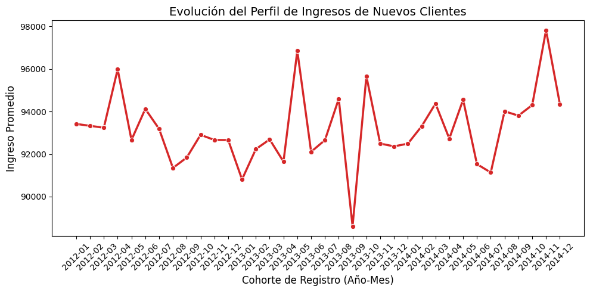
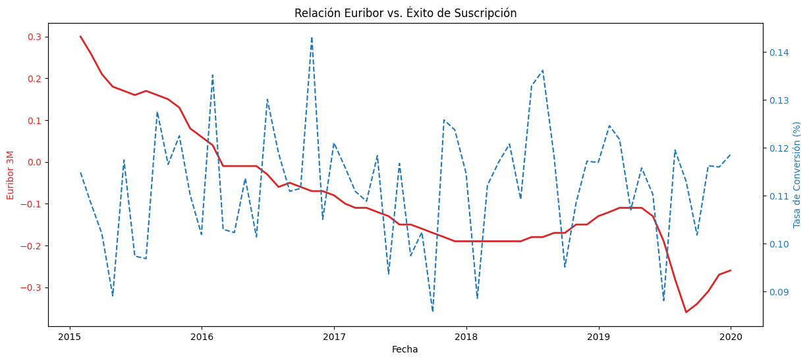

# Data Preprocessing – Bank Marketing Analysis
---
## 1. Carga de datasets

Se cargaron dos fuentes de datos principales:

- **bank-additional.csv**  
  Contiene información sobre campañas de marketing y características del cliente.

- **customer-details.xlsx**  
  Contiene información adicional del cliente distribuida en varias hojas (una por año).

```python
df_bank_csv = pd.read_csv('bank-additional.csv')
hojas_dict = pd.read_excel('customer-details.xlsx', sheet_name=None)
```

Las hojas del archivo Excel se cargaron en un diccionario para posteriormente unirlas en un único dataset.

```python
lista_dfs = []

for nombre_hoja, df in hojas_dict.items():
    df["year"] = nombre_hoja
    lista_dfs.append(df)

df_final = pd.concat(lista_dfs, ignore_index=True)
```
---

## 2. Preparación del dataset de clientes

Se realizaron algunas transformaciones iniciales sobre el dataset generado desde Excel.

Se convirtió el campo `year` a tipo entero y se extrajo el mes de la fecha de registro del cliente.

```python
df_final['year'] = df_final['year'].astype(int)
df_final['month'] = df_final['Dt_Customer'].dt.month
```

También se reorganizó el identificador del cliente para colocarlo como primera columna.

```python
col = df_final.pop('Unnamed: 0')
df_final.insert(0, 'customer_id', col)
```

---

## 3. Preparación del dataset de campañas

En el dataset principal se renombró el identificador de cliente para unificarlo con el otro dataset.

```python
col = df_bank_csv.pop('id_')
df_bank_csv.insert(0, 'customer_id', col)
df_bank_csv.drop(columns=['Unnamed: 0'], inplace=True)
```

Posteriormente se verificó la intersección de clientes entre ambos datasets.

```python
customer_ids_bank = set(df_bank_csv['customer_id'])
customer_ids_final = set(df_final['customer_id'])

customer_ids_intersection = customer_ids_bank.intersection(customer_ids_final)
```

Esto permite comprobar qué clientes aparecen en ambas fuentes de datos.

---

## 4. Tratamiento de valores nulos

Se aplicaron diferentes estrategias según la naturaleza de cada variable.

### Age

Los valores faltantes se reemplazaron por la media de la variable.

```python
df_bank_csv['age'] = df_bank_csv['age'].fillna(df_bank_csv['age'].mean())
df_bank_csv['age'] = df_bank_csv['age'].astype(int)
```

### Date

Los valores nulos representaban menos del 1% del dataset, por lo que se eliminaron.

```python
df_bank_csv = df_bank_csv.dropna(subset=['date'])
```

### Job

Los valores nulos se sustituyeron por una nueva categoría.

```python
df_bank_csv['job'] = df_bank_csv['job'].fillna('unknown')
```

### Marital

Los valores faltantes eran muy pocos y no mostraban ningún patrón relevante, por lo que se eliminaron.

```python
df_bank_csv = df_bank_csv.dropna(subset=['marital'])
```

### Education

Se redujo la cardinalidad agrupando los distintos niveles de educación básica.

```python
df_bank_csv['education'] = df_bank_csv['education'].replace(
    ['basic.4y', 'basic.6y', 'basic.9y'],
    'basic'
)
```

Los valores faltantes se sustituyeron por la categoría `unknown`.

```python
df_bank_csv['education'] = df_bank_csv['education'].fillna('unknown')
```

### Housing

Los valores faltantes se reemplazaron por la moda de la variable.

```python
mode_housing = df_bank_csv['housing'].mode()[0]
df_bank_csv['housing'] = df_bank_csv['housing'].fillna(mode_housing)
```

### Loan

Se creó una categoría especial para representar valores desconocidos.

```python
df_bank_csv['loan'] = df_bank_csv['loan'].fillna(-1)
```

---

## 5. Conversión de tipos de datos

Algunas columnas contenían valores numéricos almacenados como texto debido al uso de coma decimal.

### Consumer Price Index

Se transformó la columna a tipo numérico.

```python
df_bank_csv['cons.price.idx'] = (
    df_bank_csv['cons.price.idx']
    .str.replace(',', '.', regex=False)
    .astype(float)
)

mean_value = df_bank_csv['cons.price.idx'].mean()
df_bank_csv['cons.price.idx'] = df_bank_csv['cons.price.idx'].fillna(mean_value)
```

### Consumer Confidence Index

También se convirtió a tipo `float`.

```python
df_bank_csv['cons.conf.idx'] = (
    df_bank_csv['cons.conf.idx']
    .str.replace(',', '.', regex=False)
    .astype(float)
)
```

### Number of Employees

Se eliminaron los decimales y se convirtió a entero.

```python
df_bank_csv['nr.employed'] = (
    df_bank_csv['nr.employed']
    .str.split(',')
    .str[0]
    .astype(int)
)
```

---

## 6. Corrección del Euribor

La variable `euribor3m` tenía valores inconsistentes, por lo que se utilizó un dataset externo con datos históricos del Euribor.

Se cargó y limpió el dataset externo.

```python
df_euribor = (
    pd.read_csv('euribor.csv', sep=';')
    .drop(columns=['Unnamed: 3'])
)
```

Se transformó el formato de los valores.

```python
df_euribor['Valor'] = (
    df_euribor['Valor']
    .str.replace('%', '', regex=False)
    .str.replace(',', '.', regex=False)
    .astype(float)
)
```

Se creó una clave temporal para poder unir los datasets.

```python
df_euribor['match'] = df_euribor['Mes'] + '-' + df_euribor['Año'].astype(str)
```

Posteriormente se realizó el `merge`.

```python
df_trials = df_bank_csv.merge(
    df_euribor[['match', 'Valor']],
    left_on='euribor3m_date',
    right_on='match',
    how='left'
)
```

Los valores faltantes se rellenaron con la moda.

```python
df_bank_csv['euribor3m'] = df_bank_csv['euribor3m'].fillna(
    df_bank_csv['euribor3m'].mode()
)
```

---

## 7. Transformación de fechas

La columna `date` se separó inicialmente en día, mes y año.

```python
df_bank_csv[['day','month','year']] = df_bank_csv['date'].str.split('-', expand=True)
```

Se convirtió el mes de texto a número utilizando un diccionario.

```python
meses = {
    'enero':1, 'febrero':2, 'marzo':3, 'abril':4,
    'mayo':5, 'junio':6, 'julio':7, 'agosto':8,
    'septiembre':9, 'octubre':10, 'noviembre':11, 'diciembre':12
}

df_bank_csv['month'] = df_bank_csv['month'].map(meses)
```

Finalmente se reconstruyó la fecha y se convirtió a formato `datetime`.

```python
df_bank_csv['date'] = pd.to_datetime(
    df_bank_csv['day'].astype(str) + '-' +
    df_bank_csv['month'].astype(str) + '-' +
    df_bank_csv['year'].astype(str),
    format='%d-%m-%Y'
)
```

Se eliminaron las columnas auxiliares utilizadas en el proceso.

```python
df_bank_csv.drop(columns=['day', 'month', 'year'], inplace=True)
```

---

## 8. Exportación de datasets limpios

Finalmente se exportaron los datasets ya procesados para su uso en análisis posteriores.

```python
df_bank_csv.to_csv('cleaned_csv/bank_additional_cleaned.csv', index=False)
df_final.to_csv('cleaned_csv/customer_details_cleaned.csv', index=False)
```

Estos datasets contienen datos:

* Limpios
* Normalizados
* Con tipos correctos
* Listos para análisis exploratorio y modelado.

---

## 9. Visualización de Resultados Post-Procesamiento

Tras la limpieza y unificación de los datasets, se generaron visualizaciones estratégicas para validar la integridad de los datos y extraer los primeros insights de negocio.

### A. Validación del Conjunto de Clientes
Este gráfico confirma que la consolidación de las hojas anuales del archivo `customer_details_clean.csv` se realizó correctamente, permitiendo observar la evolución del perfil económico de los clientes captados entre 2012 y 2014.


*Nota: Se observa una recuperación en la calidad del perfil captado hacia finales de 2014, validando que el proceso de normalización de la columna `Income` fue exitoso.*

### B. Impacto Macroeconómico (Datos de Campaña + Euribor Externo)
Gracias a la corrección del Euribor mediante el dataset externo (punto 6), podemos analizar con precisión cómo influyen los tipos de interés en la suscripción de depósitos.


*Nota: La correlación inversa detectada entre la caída del Euribor y los picos de suscripción justifica el esfuerzo técnico de limpieza de la variable `euribor3m`.*

---

## 10. Conclusión del Proceso
El flujo de preprocesamiento aplicado garantiza que el ruido estadístico, los errores de formato y las inconsistencias externas no afecten a los modelos de Machine Learning. 

**Dataset Final:**
- **Registros totales:** [Número de filas tras dropna]
- **Variables corregidas:** 12
- **Fuentes integradas:** CSV (Campañas), CSV (Clientes) y CSV Externo (Euribor).

El proyecto está ahora en condiciones de avanzar a la fase de **Análisis Exploratorio de Datos (EDA)** avanzado y modelado predictivo.